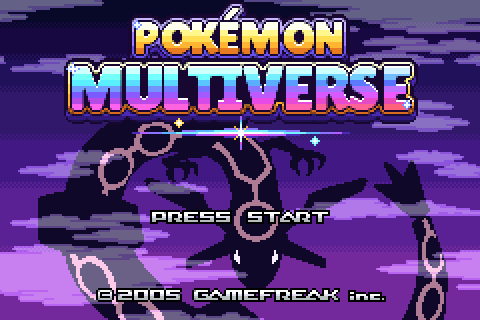
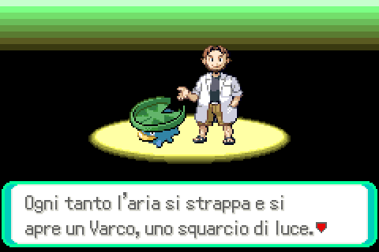
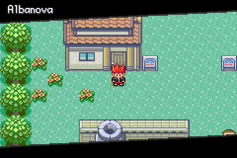
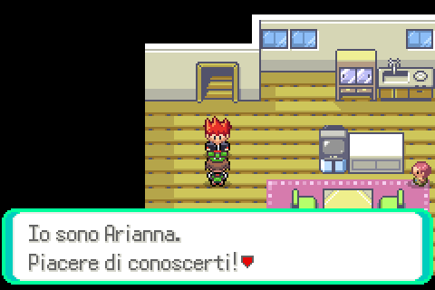
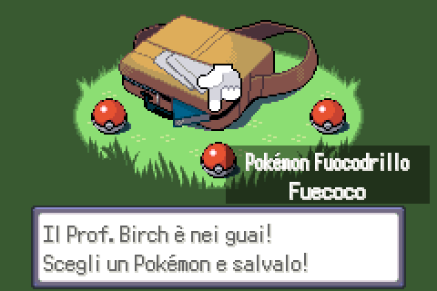
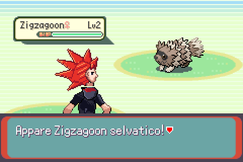
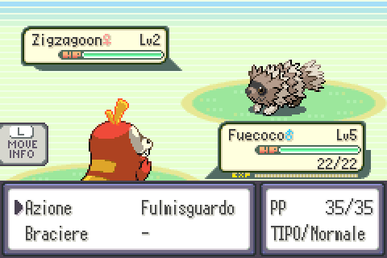

# Pokémon Multiverse — Atto 1: Hoenn

**Un'avventura completamente in italiano, ambientata in una Hoenn dove l'aria a volte si strappa… e da ogni Varco arriva un Pokémon da un altro mondo.**



Pokémon Multiverse è una ROM hack per Game Boy Advance basata su
[pokeemerald-expansion](https://github.com/rh-hideout/pokeemerald-expansion) 1.17.1.
La versione 1 contiene l'**Atto 1: Hoenn**, giocabile dall'inizio alla Lega Pokémon.

---

## La storia (senza spoiler)

Da qualche anno, in tutta Hoenn, l'aria a volte *si strappa*. Per pochi istanti si apre un
**Varco**: una ferita di luce nell'erba alta, sul pelo dell'acqua, in fondo a una grotta. Quando
si richiude, qualcosa è rimasto dall'altra parte… e qualcosa è arrivato di qua. Pokémon mai visti
nella regione, provenienti da Kanto, Sinnoh, Kalos, Paldea e da mondi ancora più lontani, ora
vivono accanto a quelli di Hoenn.

Tu sei il figlio di Norman, il nuovo Capopalestra di Petalipoli, appena trasferito ad
**Albanova**. Il tuo vicino, il Prof. Birch, studia proprio le creature arrivate dai Varchi, e sta
per affidarti una di loro: **Turtwig**, **Fuecoco** o **Froakie**. Ma non sei l'unico interessato
ai Varchi: due gruppi rivali, il **Team Alpha** e il **Team Omega**, nati da un'unica
organizzazione, hanno idee molto diverse su cosa farne… e nessuna delle due promette niente di
buono.

Otto Medaglie, una Lega, un multiverso intero dietro l'orizzonte. **Atto 1: Hoenn.**

---

## Caratteristiche

- **Tutto in italiano**: dialoghi riscritti per la nuova storia, menu, lotte, Pokédex, strumenti,
  mosse e abilità; nomi ufficiali italiani di città, Capipalestra, Superquattro e Parco Lotta.
- **Tutte le 1025 specie** dalla 1ª alla 9ª generazione ottenibili, con le meccaniche moderne di
  pokeemerald-expansion (tipo Folletto, divisione fisico/speciale, abilità e mosse fino alla Gen 9).
- **Nuovi starter**: Turtwig, Fuecoco e Froakie, arrivati da un Varco.
- **Nuovo protagonista**, con sprite inediti (capelli rossi a punta e abiti scuri).
- **Livello massimo (level cap)** legato alle Medaglie, con esperienza ridotta oltre il limite e
  più esperienza per chi è sotto il limite; le Caramelle Rare non superano il limite.
- **Allenatori più forti**: squadre ribilanciate e IA avanzata per Capipalestra, Superquattro,
  rivali e boss (cambi intelligenti, scelta del Pokémon, gestione dei PS, asso finale).
- **Pokémon che ti seguono** sul campo, come in HeartGold e SoulSilver.
- **Ciclo giorno/notte** con orologio interno simulato: nessun problema di batteria o di
  orologio su emulatori e console.
- **Pokédex in stile HGSS**, nomi dei luoghi in stile Nero e Bianco, anteprime delle mappe.
- Stile di lotta **Fisso** predefinito; strumenti evolutivi usabili direttamente dalla Borsa.
- Menu di debug disattivati (build `release`).

| | |
|---|---|
|  |  |
|  |  |
|  |  |

---

## Come giocare

Non distribuiamo ROM. Ti serve la **tua copia legale** di
**Pokémon - Emerald Version (USA, Europe)** (`.gba`, 16 MB) e la patch
[`patch/Pokemon_Multiverse_v1.bps`](patch/Pokemon_Multiverse_v1.bps).

| ROM richiesta | |
|---|---|
| Nome | Pokemon - Emerald Version (USA, Europe) |
| Dimensione | 16 777 216 byte |
| CRC32 | `1F1C08FB` |
| SHA-1 | `f3ae088181bf583e55daf962a92bb46f4f1d07b7` |

La ROM risultante pesa 32 MB e ha SHA-1 `b376b93ef26741b86ad5e24cea7583e9ca84c2c5`
(i dettagli sono in [`patch/Pokemon_Multiverse_v1.txt`](patch/Pokemon_Multiverse_v1.txt)).

### Applicare la patch su Mac (o su qualsiasi computer)

1. Apri **[Rom Patcher JS](https://www.marcrobledo.com/RomPatcher.js/)** in Safari, Chrome o Firefox
   (funziona nel browser, non carica i file su nessun server).
2. In **ROM file** scegli la tua `Pokemon - Emerald Version (USA, Europe).gba`. Il sito mostra il
   CRC32: deve essere `1F1C08FB`.
3. In **Patch file** scegli `Pokemon_Multiverse_v1.bps`.
4. Premi **Apply patch** e salva il file, per esempio come `Pokemon_Multiverse_v1.gba`.

In alternativa puoi usare [Floating IPS (Flips)](https://github.com/Alcaro/Flips) o applicare la
patch al volo con mGBA (stesso nome del file `.gba` con estensione `.bps`, nella stessa cartella).

Su Mac la ROM si gioca con **[mGBA](https://mgba.io/)** oppure **OpenEmu**. Il salvataggio è di
tipo Flash 128K (1 Mbit) e viene riconosciuto automaticamente.

### Giocare su Nintendo 3DS

**Metodo consigliato: mGBA per 3DS** (serve un 3DS con custom firmware, es. Luma3DS + homebrew).

1. Installa **mGBA** per 3DS (file `.cia` dalla pagina [mgba.io/downloads](https://mgba.io/downloads.html),
   da installare con FBI, oppure la versione `.3dsx` dall'Homebrew Launcher).
2. Copia `Pokemon_Multiverse_v1.gba` sulla scheda SD (per esempio in `/roms/gba/`).
3. Avvia mGBA, apri la ROM e gioca. Il salvataggio Flash 128K viene rilevato da solo e scritto
   accanto alla ROM (`.sav`).

**Metodo alternativo: iniezione nella Virtual Console GBA** (icona sulla HOME, prestazioni native).

1. Usa uno strumento di iniezione GBA VC come **NSUI (New Super Ultimate Injector)**.
2. Come icona usa [`assets/3ds_icon_48.png`](assets/3ds_icon_48.png) e come banner
   [`assets/3ds_banner_256x128.png`](assets/3ds_banner_256x128.png); titolo
   "Pokémon Multiverse".
3. Imposta il tipo di salvataggio su **FLASH 128K (1M)**; se lo strumento chiede l'RTC puoi
   lasciarlo disattivato.
4. Installa il `.cia` generato con FBI.

Il gioco usa un **orologio interno simulato** (fake RTC), quindi il ciclo giorno/notte e gli eventi
a tempo funzionano anche dove la cartuccia virtuale non ha l'orologio, come nella Virtual Console.

---

## Compilare dai sorgenti

La cartella [`hack/`](hack/) contiene solo i file di pokeemerald-expansion 1.17.1 modificati o
aggiunti dalla hack. Lo script [`build.sh`](build.sh) scarica l'expansion al tag
`expansion/1.17.1`, copia sopra i file della hack e compila la ROM in
`out/Pokemon_Multiverse_v1.gba`.

```sh
./build.sh            # macOS o Linux
```

### Prerequisiti su macOS

1. **Xcode Command Line Tools**: `xcode-select --install`
2. **[Homebrew](https://brew.sh/)**, poi:
   ```sh
   brew install libpng pkg-config
   brew install --cask gcc-arm-embedded      # fornisce arm-none-eabi-gcc
   ```
   In alternativa alla toolchain di Homebrew puoi installare **devkitPro/devkitARM**
   (`sudo dkp-pacman -S gba-dev`) ed esportare `DEVKITPRO=/opt/devkitpro` e
   `DEVKITARM=$DEVKITPRO/devkitARM`.
3. Esegui `./build.sh`. La prima compilazione richiede alcuni minuti.

### Prerequisiti su Linux (Debian/Ubuntu)

```sh
sudo apt install build-essential git libpng-dev pkg-config gcc-arm-none-eabi libnewlib-arm-none-eabi
```

Con un compilatore diverso la ROM ottenuta può non essere identica byte per byte a quella della
patch BPS, ma è equivalente.

---

## Riconoscimenti

- **[pokeemerald-expansion](https://github.com/rh-hideout/pokeemerald-expansion)** del team
  **Rom Hacking Hideout (RHH)** e di tutti i suoi collaboratori: la base della hack.
- **[pret](https://github.com/pret)**: il progetto di decompilazione di Pokémon Smeraldo.
- **[PokeAPI](https://pokeapi.co/)**: dati e testi ufficiali italiani di Pokémon, mosse,
  abilità e strumenti.
- **Lilita One** di Juan Montoreano, sotto licenza
  [SIL Open Font License 1.1](tools/gfx/fonts/OFL-lilitaone.txt), usato per il logo del titolo.
- **[mGBA](https://mgba.io/)** per i test automatici, **Floating IPS** e **Rom Patcher JS**
  per la patch.

## Nota legale

Questo è un progetto amatoriale, gratuito e senza scopo di lucro, non affiliato né approvato da
Nintendo, Game Freak, Creatures Inc. o The Pokémon Company. **Pokémon** e tutti i nomi, i
personaggi e i marchi correlati sono © Nintendo / Creatures Inc. / GAME FREAK inc.
Il repository **non contiene ROM**: la patch funziona solo con una copia del gioco originale in
tuo legittimo possesso.
